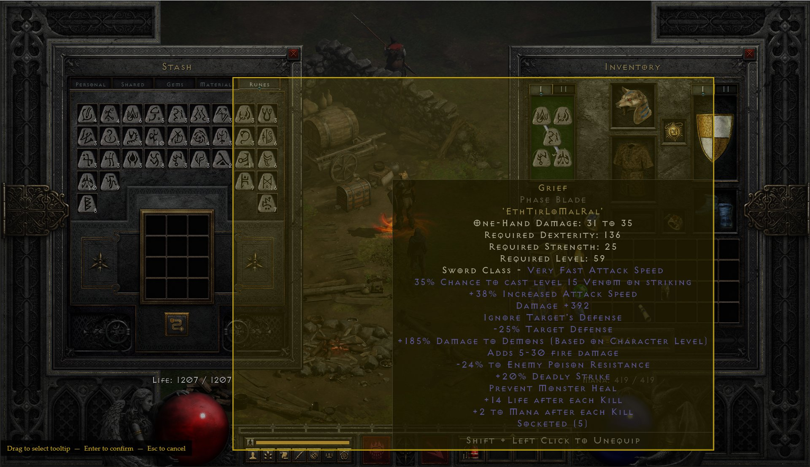
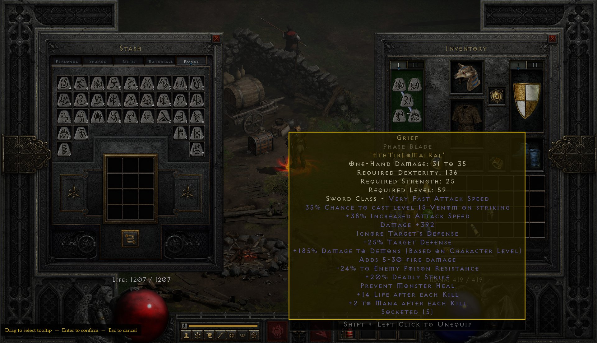
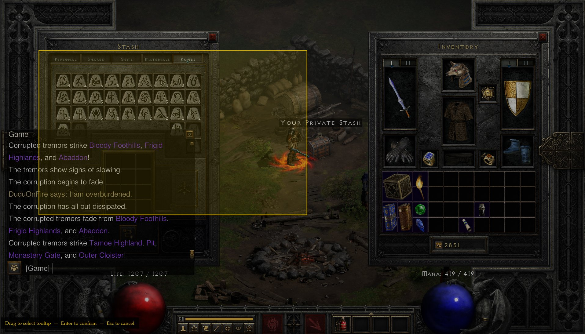
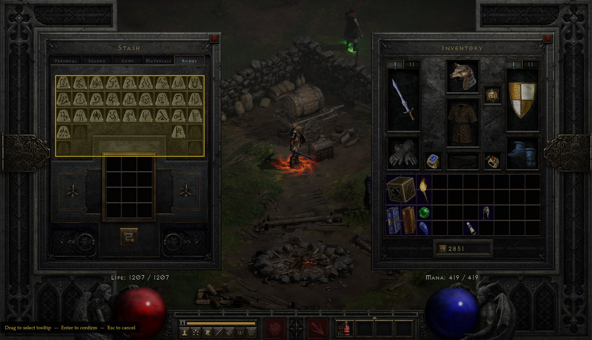
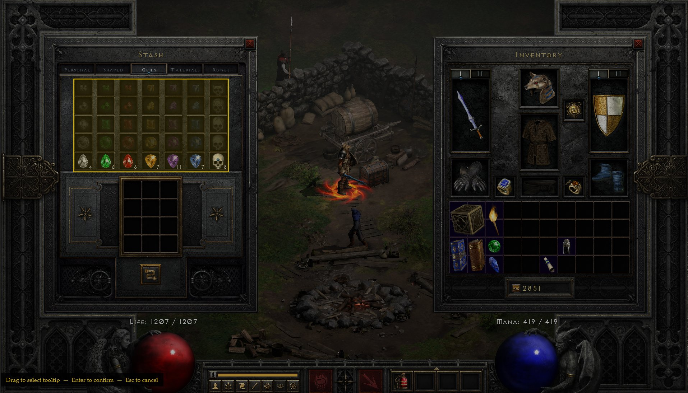
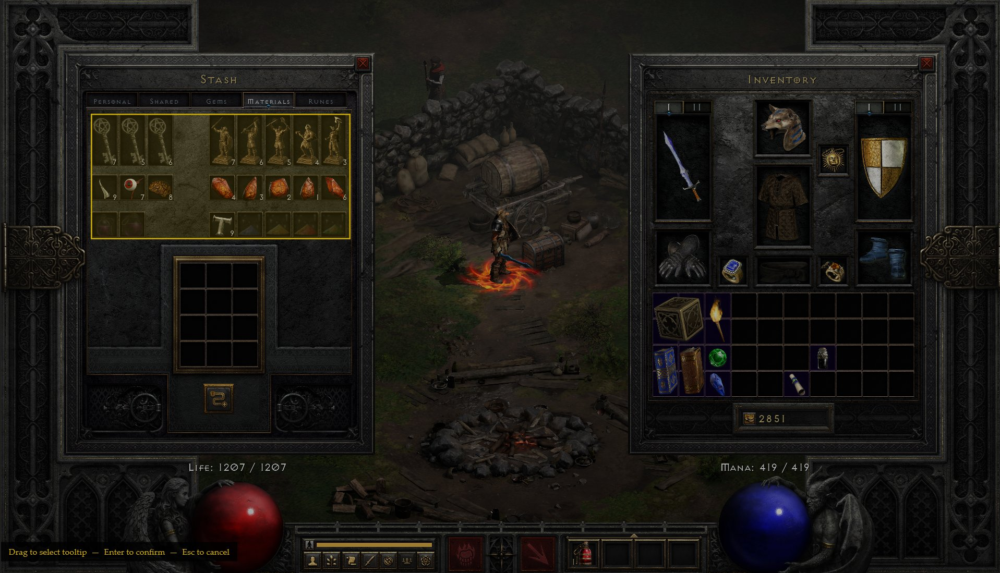

# ✦ D2R Buddy ✦

**A free companion app for Diablo II: Resurrected**

*Item tracking · Run logging · Rune calculator · Character management*

---

  

---

## What is D2R Buddy?

D2R Buddy is a free Windows companion app that sits alongside D2R and handles the tracking and management work that nobody wants to do manually — without reading game memory or breaking Blizzard's Terms of Service.

It works by taking a screenshot of your item tooltip when you press a hotkey, then using Google's Gemini AI (can use the free tier) to read the stats automatically. Everything is stored locally on your machine.

**Safe to use online.** D2R Buddy does not read game memory, inject into the game process, or automate any in-game actions. It only takes a screenshot when you manually press a hotkey.

---

## Features

| Feature | Description |
|---|---|
| **AI Item Capture** | Press `Ctrl+Alt+C` over any tooltip. Stats are read automatically and stored per character and stash tab |
| **Multi-Account Tracking** | Track multiple accounts, characters, and all stash tabs (Inventory, Personal, Shared 1–5) |
| **Gems / Runes / Materials** | Dedicated tabs scanned by drag-selecting your stash grid — no individual captures needed |
| **Rune Calculator** | See which runewords you can build now, including cascaded cube upgrades |
| **Run Log** | Track farming runs by location with session and total counters |
| **Herald Kills** | Track Herald of the Endgame tier kills (T1–T5) |
| **Character Tracker** | Larzuk, Hellforge, and Bumper quest status per difficulty across all characters |
| **All Items View** | Search every captured item across all accounts in one list. Jump to its stash tab instantly |
| **Goals Panel** | Running to-do list for runewords, sets, trades — check them off as you go |
| **Auto-Updates** | Updates automatically in the background |

---

## Installation

1. Download `D2RBuddy-Setup.exe` from the [latest release](../../releases/latest)
2. Run the installer — D2R Buddy installs to your user folder (no admin required)
3. On first launch, enter your free Gemini API key when prompted (or skip and add it later)
4. Add a name for your account and first character, and you're set (no passwords or login required)

**System requirements:** Windows 10/11 · .NET 10 (bundled with installer) · Internet connection for AI capture, can be used offline without

---

## Setup: Gemini API Key

Item capture uses Google Gemini AI to read tooltip stats. You need a free API key to use this feature. Everything else (run tracking, rune calculator, character tracking, goals) works without it.

1. Go to [aistudio.google.com](https://aistudio.google.com) and sign in with a Google account
2. Click **Get API Key → Create API key**
3. Copy the key and paste it into D2R Buddy's setup dialog, or **Settings → Update API Key**

> **Free tier:** About 250 captures/day at no cost — more than enough for normal play sessions.
> Exceeding this may incur small charges (~$0.001/capture). You are responsible for your own API usage.

---

## Item Capture Guide

### Individual Items

Press `Ctrl+Alt+C` while hovering over any item tooltip. A selection overlay appears — drag to select the tooltip, then press `Enter` to confirm.

**The most important rule: keep your selection tight.**
AI reads everything in the selection box. Extra UI, chat, inventory background, and empty space all reduce accuracy. Select only the tooltip text.

<table>
<tr>
<th>✕ Bad — Selection too large</th>
<th>✓ Good — Tight around tooltip only</th>
</tr>
<tr>
<td></td>
<td></td>
</tr>
<tr>
<td>Includes the stash window, inventory panel, and background. AI has to guess which text belongs to the item and may misread stats.</td>
<td>Tight around only the tooltip. Clean background, all stat lines visible. AI reads this accurately every time.</td>
</tr>
</table>

> **Tip:** D2R Buddy tries to auto-detect the tooltip border when the overlay opens. If the yellow box appears in the right place, just press `Enter` straight away — no dragging needed.

---

### Special Tabs — Gems, Runes & Materials

Open the matching stash tab in D2R, press `Ctrl+Alt+C`, then drag to select the **entire stash grid** — not individual items.

#### Runes

<table>
<tr>
<th>✕ Bad — Too much selected</th>
<th>✓ Good — Rune grid only</th>
</tr>
<tr>
<td></td>
<td></td>
</tr>
<tr>
<td>Includes the chat box, game messages, and empty stash rows. Confuses the AI and may cause incorrect rune counts.</td>
<td>Only the rune grid. No chat, no empty rows, no inventory panel. Clean and accurate.</td>
</tr>
</table>

#### Gems

<table>
<tr>
<th>✓ Good — Gem grid only</th>
</tr>
<tr>
<td></td>
</tr>
<tr>
<td>Select just the gem grid including the bottom row with counts visible. Exclude the cube socket area below.</td>
</tr>
</table>

#### Materials

<table>
<tr>
<th>✓ Good — Materials grid only</th>
</tr>
<tr>
<td></td>
</tr>
<tr>
<td>Select the full materials grid including item icons and stack counts. Exclude the Horadric Cube and empty space below.</td>
</tr>
</table>

---

---

## Keyboard Shortcuts

| Shortcut | Action |
|---|---|
| `Ctrl + Alt + C` | Capture item or scan stash tab (works globally while D2R is running) |
| `Enter` | Confirm selection in the capture overlay |
| `Esc` | Cancel capture |
| `Shift + Click Settings` | Re-run API key setup |

---

## FAQ

**Is this safe to use online?**
Yes. D2R Buddy does not read game memory, inject into the process, or automate any in-game actions. It is ToS safe.

**Do I need the API key?**
No. Run tracking, rune calculator, character tracking, goals, and all other features work without it. Only item capture requires the key.

**The capture reads stats incorrectly — what do I do?**
Make sure your selection is tight around only the tooltip with no extra UI elements. You can also edit any stats in the confirm window before saving.

**Does it work for offline characters?**
Yes — all features work for offline characters.

**Where is my data stored?**
All data is stored locally in a SQLite database at `%LocalAppData%\D2RBuddy\d2rbuddy.db`. Nothing is sent to any server except tooltip images to Google Gemini during item capture.

**Will updates wipe my data?**
No. Your database is stored in a permanent location outside the versioned install folders and is never touched by updates.

---

## Support & Feedback

This is a free community app built for the D2R community. If you find it useful:

- **[☕ Ko-fi](https://ko-fi.com/ihavereturnd)** — completely optional, always appreciated
- **[💬 d2jsp](https://forums.d2jsp.org/user.php?i=207257)** — bug reports, feedback, suggestions
- **Open an issue** on this repo for bugs or feature requests

---

## Changelog

### v0.1.9
- Initial Public Release
- Fix for database link not updating with version updates under specific circumstances

### v0.1.8
- Fixed database persistence across updates — data now survives version upgrades
- Fixed first-run tour and API key prompt appearing again after updates
- Added DOCS tab with capture guide and screenshot examples
- Added version number display in top-left of app
- OCR mode removed — AI Vision is now the only capture mode (higher accuracy, works at any resolution)
- Skip option added to API key setup — all non-capture features usable without a key
- Fixed guided tour overlay appearing over other apps when D2R Buddy is minimized
- Fixed rare crash when resizing the window during the first-run tour

### v0.1.7
- Auto-update support via Velopack
- AI Vision capture improvements

### v0.1.6
- Initial Private Release
---

*D2R Buddy is free to use. Not affiliated with Blizzard Entertainment.*
*Diablo II: Resurrected is a trademark of Blizzard Entertainment.*

© 2025 iHaveReturnd · Free for personal use · Redistribution and commercial use prohibited

